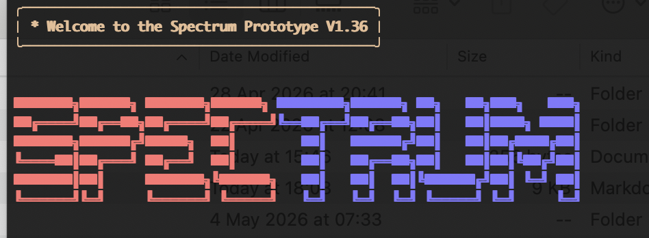

### <span style="font-family: 'Glacial Indifference', sans-serif; font-size: 100px;"><span style="color:red">Spec</span><span style="color:blue">trum</span></span>

<p align="center">
  <a href="https://github.com/spectrum-redteam/spectrum/commits/main">
    
  </a>
  <a href="https://github.com/spectrum-redteam/spectrum-project">
    
  </a>
  <a href="https://github.com/spectrum-redteam/spectrum/blob/main/LICENSE">
    
  </a>
  <a href="https://pypi.org/project/spectrum-security/">
    
  </a>
  <a href="https://pypi.org/project/spectrum-security/">
    
  </a>
</p>
Spectrum is an agentic security tool created by Roland Poon and William Jiang. It runs on HuggingFace Inference API or AMD Cloud. 

It is made with Python and runs on most systems including macOS and Windows, and Debian or Ubuntu distributions including Kali Linux (Debian).  The tool is lightweight and can be configured to use a local SQLITE database and also local cybersecurity tools such as Tshark, Wireshark and John The Ripper or similar. This also comes prepackaged with wordlists.


## Quickstart
Since Spectrum runs on Python you should have Python 3.0 and pip or pip3. I have created install scripts for as many platforms I can think of.
#Linux
**Ubuntu/Debian**
This is an install script hosted on Github Pages.
```bash
curl -fSSL https://spectrum-redteamer.github.io/spectrum-apt/install.sh
```

**AUR(Arch Linux)**
```bash
yay -S spectrum
```
#General
**Python package**
```bash
pip install spectrum-security
    #or
pip3 install spectrum-security
```
**UV(Ultraviolet)**
```bash
uvx spectrum-security
```
#macOS
**Homebrew**
```bash
brew install spectrum-security
```
**Portable Release**
```bash
./spectrum-darwin-arm64.tar.gz
```
#Windows
**Scoop**
```powershell
scoop bucket add spectrum-redteam https://github.com/spectrum-redteam/scoop-spectrum
scoop install spectrum
```
**Chocolatey**
```powershell
choco install spectrum-security
#Not yet ready for use
```
## Configuration
Most configuration can be done in the config.json file. For example you can change the core model to GLM 5.1:
```python
{
    "provider": "huggingface",
    "expert_models": [
        "deepseek-ai/DeepSeek-V3",
        "Qwen/Qwen3-Coder-480B-A35B-Instruct",
        "zai-org/GLM-5.1",
        "deepseek-ai/DeepSeek-V4-Pro",
        "deepseek-ai/DeepSeek-V4-Flash"
    ],
    "final_model_id": "zai-org/GLM-5.1",
    "sentinel_model_id": "meta-llama/Llama-3.1-8B-Instruct",
    "max_tokens_per_request": 8000,
    "temperature": 0.4,
    "use_database_framework": false,
    "use_local_bin_folder": false,
    "amd_config": {
        "endpoint": "https://api.amd.com/v1"
    }
}
```
And then you can change whether you want to connect through HuggingFace inference or AMD cloud. 

Upon setup there is a prompt asking you for your HuggingFace Access Token.
You can make one in huggingface.co after makeing an account. 

You can configure the different settings and you can turn local SQlite on and off, and you can also change the local bin folder use. 

You can always download or write your own skills and import them into the tutorials folder and the AI will follow them.
## Documentation
## Features

- **Red Team Agent**  Automated pentesting with Thought-Action-Observation loops. Scans targets, identifies vulnerabilities, writes custom exploits, and pivots through systems.
- **Blue Team Agent**  Real-time log monitoring with autonomous patching. Detects attacks, classifies threats, and rewrites vulnerable source code live.
- **Modular Tool System** Extensible Python architecture with terminal execution, HTTP interaction, and self-preservation safeguards.
- **Knowledge Base (RAG)**  Baked SQLite database of verified exploits and payloads for retrieval-augmented generation. (Must be configured)
- **Purple Teaming**  Dual-team architecture creates a continuous feedback loop where every intrusion hardens the system permanently.
- **Emergency** An emergency report is generated upon a server error or something else, so your progress is not lost.
- **Thinking** The agent uses a custom token delimiter (`䷂`) to separate its internal reasoning from its external communication. This allows the AI to "think out loud" about its strategy without cluttering the operator's log.

The LLM has full access to the terminal, and it can be configured to use tools stored in a local bin folder for specialised workflows. 
The agent uses a custom token delimiter (`䷂`) to separate its internal reasoning from its external communication. This allows the AI to "think out loud" about its strategy without cluttering the operator's log.


**File Architecture**
```json
spectrum/
L main.py
L blueteamer.py
L redteamer.py
L config.json
L __init__.py
L viewer.py
L modules/
    L hash_util.py
    L port_scanner.py
L wordlists/
    L common.txt
L tutorials/
L tools.py
```
main.py: Core file that handles the intro and config management
blueteamer.py: File that handles the blueteamer agent.
redteamer.py: File that handles the redteamer agent.
config.json: File that handles configuration
viewer.py: Renderer for a better UI.
tools.py: The core file that handles the tool use and how to AI calls commands.

### How it works
This project is controlled by a few files. 

#System
There is a Python extractor logic to extract tool calls from the AI response. Here is an example logic block.
```python
def ai_call(messages, config):
    provider = config.get("provider", "huggingface")
    if provider == "amd":
        return amd_ai_call(messages, config)
    else:
        return huggingface_ai_call(messages, config)

def huggingface_ai_call(messages, config):
    from huggingface_hub import InferenceClient
    token = os.environ.get("HF_TOKEN")
    model = config.get("final_model_id")
    for attempt in range(3):
        try:
            client = InferenceClient(model=model, token=token)
            with console.status("[bold cyan]Agent Cognition...", spinner="line"):
                response = client.chat_completion(messages=messages, max_tokens=config["max_tokens_per_request"], temperature=0.2)
            msg = response.choices[0].message
            out = f"\u4DC2\n{msg.reasoning}\n\u4DC2\n" if hasattr(msg, 'reasoning') and msg.reasoning else ""
            return out + (msg.content or "")
        except Exception as e:
            if "402" in str(e).lower() or "payment required" in str(e).lower():
                console.print("[bold red]API Quota Exhausted. Executing Emergency Save...[/bold red]")
                save_session_state(messages)
                return "Error: 402"
            time.sleep(5 * (2 ** attempt))
    return "Error: API Timeout."
```
#blueteam
Blueteamer works by first finding the process ID of the server and begins to watch for traffic. This is only tested on a UNIX based system and may not work on Windows. When the traffic is captured every 2 seconds it is analysed by a tiny model which is Qwen 2.5 3B. This means that even for thousands of requests the inference would only cost pennies but still get a model that is reasonably smart enough to watch for suspicious attack attempts.
 
 Then if the small "Sentinel" model finds an error, the IP address is flagged and blocked it is immediately sent to the larger, smarter DeepSeek V4 Flash to analyse the attempt and patch the code. There is a function to pre-index your source code so in a good scenario a critical vulnerability could be patched and resolved in under 5 seconds. This is also shown in the demo video.

 
 This is an example of the Sentinel logic.
 ```python
def sentinel_check(log_snippet, config):
    """Ask the Sentinel model to check the log - supports both HF and AMD."""
    from huggingface_hub import InferenceClient
    import requests as req

    if not log_snippet or log_snippet.strip() == "":
        return "CLEAN"

    has_any_traffic = any(word in log_snippet for word in ["GET ", "POST ", "PUT ", "DELETE ", "Form:", "Params:"])
    if not has_any_traffic:
        return "CLEAN"

    provider = config.get("provider", "huggingface")
    model = config.get("sentinel_model_id", "Qwen/Qwen2.5-3B-Instruct")

    messages = [
        {"role": "system", "content": SENTINEL_PROMPT},
        {"role": "user", "content": f"Check this log:\n\n{log_snippet}\n\nRespond CLEAN or ATTACK: <type>."}
    ]
 ```
 This is the DeepSeek call logic.

 ```python
    def verify_attack(log_snippet, suspicion, config):
    """Ask DeepSeek to verify if the attack succeeded and classify it."""
    system_prompt = DEFENSE_PROMPT
    user_msg = f"Verify this suspicious request:\n\n{log_snippet}\n\nInitial suspicion: {suspicion}\n\nDid this attack succeed? Respond NORMAL or PATCH: <type>."
    
    verify_msgs = [
        {"role": "system", "content": system_prompt},
        {"role": "user", "content": user_msg}
    ]
    
    resp = redteamer.ai_call(verify_msgs, config)
    if "Error: 402" in resp:
        return "ERROR"
    return resp.strip()

 ```

#redteam
Redteamer works by using system commands like John The Ripper, nmap and then use the powerful DeepSeek V4 Flash/Pro in order to try to run payloads and commands. It can efficiently use cURL commands and other tools to write scripts and generate payloads to use on sites.

An example of its successes can be found in the demo video.

This is how it handles the temporary files and it uses emergency file export system, so when there is a server error or 402 your progress is not gone and can be backed up.

```python
console = Console()
BASE_DIR = Path(__file__).resolve().parent
TUTORIALS_DIR = BASE_DIR / "tutorials"
ENV_PATH = BASE_DIR / ".env"
CONFIG_PATH = BASE_DIR / "config.json"
SESSION_MD = BASE_DIR / "session.md"
DUMP_PATH = BASE_DIR / "operation_state_recovery.json"
THOUGHTS_PATH = BASE_DIR / "thoughts.json"
#code found in redteamer
```
This project also supports external Skills imports through the tutorials directory.
```python

def get_tutorial_knowledge():
    knowledge = "\n# ABSOLUTE SYSTEM DIRECTIVES (MUST BE FOLLOWED STRICTLY):\n"
    if TUTORIALS_DIR.exists():
        for file in TUTORIALS_DIR.glob("*.md"):
            try: knowledge += f"## Directive Set: {file.name}\n{file.read_text(encoding='utf-8', errors='ignore')}\n\n"
            except: pass
        for file in TUTORIALS_DIR.glob("*.txt"):
            try: knowledge += f"## Reference: {file.name}\n{file.read_text(encoding='utf-8', errors='ignore')}\n\n"
            except: pass
    return knowledge
    #code found from redteamer
```
## Troubleshooting
If Spectrum fails to launch, first verify your Python version is 3.10 or higher with python3 --version. The most common issue is the binary not being found on PATH after installation. Run which spectrum to confirm the install location, and if it returns nothing, add 
```bash
export PATH="$HOME/Library/Python/3.11/bin:$PATH"
```
 to your shell configuration file. On macOS, Homebrew may place the binary in a non-standard location; check /opt/homebrew/bin or your custom Homebrew prefix.
 
  If you encounter an externally-managed-environment error on macOS, either use a virtual environment with 
  ```python
  python3 -m venv venv && source venv/bin/activate
  ```
   or pass the --break-system-packages flag to pip.
  
   For Windows Scoop users, ensure the bucket was added before installing with scoop bucket add spectrum-redteam https://github.com/spectrum-redteam/scoop-spectrum. If the Red Team agent fails to connect to a target, verify your HuggingFace API token is set with export HF_TOKEN="your_token". 
   
   When the Blue Team Sentinel fails to start, check that the target Flask application is running and that server.log is being written to the expected location. 
   
   For cached version issues where changes do not appear after an update, purge the pip cache with 
   ```python
   pip cache purge
   ```
   and reinstall with 
   ```python
   pip install spectrum-security --upgrade --no-cache-dir --force-reinstall
   ```
   
   If you hit a 402 Payment Required error, the agent will save its state to operation_state_recovery.json and resume automatically on restart. Any other issues can be reported at the GitHub repository.

=======
# Spectrum – Red/Blue Team AI Framework

A dual‑mode autonomous security platform.  
Run as **Red Team** to attack a target, or as **Blue Team** to monitor, detect intrusions and hot‑patch vulnerabilities.  
Powered by Hugging Face (or AMD Cloud) models.

---

## Prerequisites

- Python 3.10 or newer
- pip
- A Hugging Face account ([hf.co](https://hf.co)) and an API token
- Git (optional – you can also download the ZIP)

---

## Clone the project

~~~bash
git clone https://github.com/yourusername/spectrum.git
cd spectrum
~~~

If you downloaded a ZIP, extract it and open a terminal inside the extracted folder.

---

## Install dependencies

Create and activate a virtual environment (recommended):

~~~bash
python3 -m venv venv
source venv/bin/activate       # macOS / Linux
venv\Scripts\activate          # Windows
~~~

Install the required packages:

~~~bash
pip install -r requirements.txt
~~~

On macOS with Homebrew Python you may need:

~~~bash
pip install --break-system-packages -r requirements.txt
~~~

---

## Configuration

### API Provider & Token

On the first run, Spectrum asks which provider you want to use:

1. **Hugging Face** – you will be prompted for your `HF_TOKEN`.
2. **AMD Cloud** – you will be prompted for your `AMD_API_KEY`.
3. **Google Gemini**- Experimental, prompted for API key.

The token is saved in a `.env` file.  
You can also create that file manually:

~~~bash
echo "HF_TOKEN=hf_xxxxxxxxxxxxxxxxxxxx" > .env
~~~

(Replace `hf_xxxxxxxxxxxxxxxxxxxx` with your actual token.)

### Model selection (`config.json`)

The default models work out of the box.  
You can change `final_model_id` (the main agent) and `sentinel_model_id` (the lightweight Blue Team watcher) inside `config.json`.

Example excerpt:

~~~json
{
    "final_model_id": "deepseek-ai/DeepSeek-V4-Flash",
    "sentinel_model_id": "Qwen/Qwen2.5-3B-Instruct"
}
~~~

---

## Run a vulnerable target (optional)

The project includes a deliberately vulnerable Flask application (`lab.py`).  
Start it in a separate terminal to give the agents something to attack/defend:

~~~bash
python3 lab.py
~~~

It listens on `http://127.0.0.1:4999` (or the port printed in the terminal).

---

## Launch Spectrum

~~~bash
python3 main.py
~~~

You will see the Spectrum banner. Press **Enter** to continue.

### Choose your mode

~~~text
Select Operational Module:
  1. Red Team (Offensive)
  2. Blue Team (Defensive)
  3. Exit
~~~

---

### Red Team Mode

1. Enter a target / objective, for example:  
   `Find the hidden flag on http://127.0.0.1:4999`
2. The agent will plan, execute terminal commands, write scripts, and attempt to breach the target.
3. **Ctrl+C** to pause, then:
   - `s` – steer the agent (give an instruction)
   - `p` – pause and save the session
   - `Enter` – resume

---

### Blue Team Mode

1. Enter the URL to defend, for example:  
   `http://127.0.0.1:4999`
2. The Blue Team will:
   - Kill the existing server (if any) and restart it with logging enabled.
   - Start a Sentinel (small AI model) that watches the log file every few seconds.
   - When an attack is detected:
     - Record the attacker IP (in `blocked_ips.txt`).
     - Ask the main model to classify the attack.
     - Automatically patch the vulnerable code (SQLi, command injection, SSTI, etc.).
     - Restart the server with a fresh log.
3. **Ctrl+C** to pause, same steering options as Red Team.

---

## File structure (key files)

~~~
spectrum/
├── main.py               # Entry point, mode selector
├── redteamer.py          # Offensive agent logic
├── blueteamer.py         # Defensive agent (Sentinel + patcher)
├── tools.py              # Tool implementations (shell, HTTP, file I/O, patch engine)
├── lab.py                # Vulnerable SAAS lab (for testing)
├── config.json           # Model IDs and provider settings
├── requirements.txt      # Python dependencies
├── tutorials/            # Optional playbooks loaded by agents
├── blocked_ips.txt       # IPs blocked during Blue Team sessions
├── attacks.log           # Record of detected attacks
├── server.log            # Flask output (created at runtime)
├── session.md            # Live session log (viewed by viewer.py)
└── thoughts.json         # Agent reasoning trail
~~~

---

## Troubleshooting

- **ModuleNotFoundError** → run `pip install -r requirements.txt` again.
- **API Quota Exhausted** → wait a few minutes or switch to another model in `config.json`.
- **Blue Team doesn't detect attacks** → ensure the target was started with logging (the Blue Team does this automatically for `lab.py`).
- **Terminal output looks broken** → run `main.py` in a standard terminal; Rich formatting works best there.

---


For questions or contributions, open an issue on the project's GitHub page.
